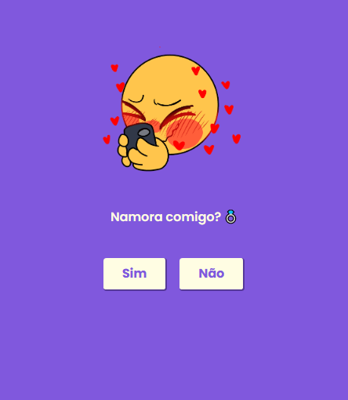

# ForLove

Este projeto objetiva o desenvolvimento de uma aplicação WEB para brincar um pouco com os com os estados em React e enviar a/o crush apenas por diversão (ou não kkk).

<p align="center">
  <a href="#"></a>
  <a href="#"></a>
  <a href="#"></a>
</p>

<p align="center">
  
</p>


## Demonstração

https://forloove.vercel.app/

## Instalação

Clone o repositório com ```https://github.com/EduardoPH/ForLet```

Acesse a pasta do repositório e instale as dependências com ```npm i```

Para rodar o projeto, execute ```npm start```

## Autores

- [Eduardo Mendes](https://www.github.com/EduardoPH)
